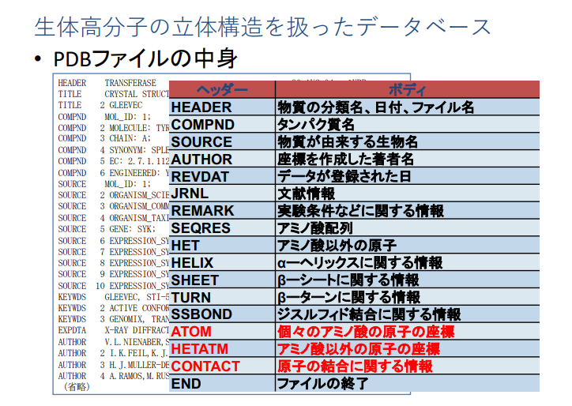
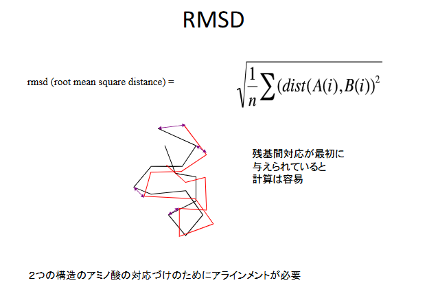
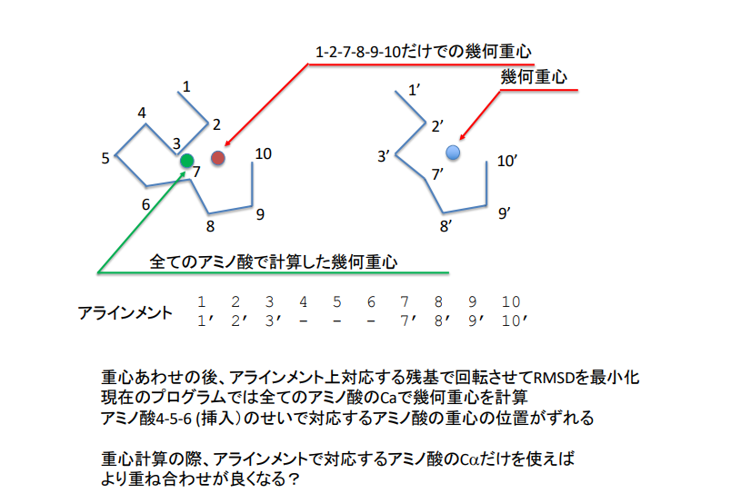

# Sentan-3-Toh

先端生命科学実験の藤先生回分のプログラムフォルダ

## この資料について

この資料は(インフレが起きて先生にばれない程度に)他の人にも教えてもokです。  
Pythonに関しては全部書ききれないのでここに載ってる用語を追加で調べることを推奨します。  
不明点などあれば自分まで聞いてもらえたら対応します。  

### ファイル構成

```text
Sentan-3-Toh/
├─ README.md        - 解説資料(今見てるファイル)
├─ assets           - READMEに貼ってる画像のフォルダ
├─ LICENSE          - 気にしなくてok
├─ command.txt      - LUNAの資料(Windows用)
├─ execute_GA.py    - LUNAの資料に解説を付けたもの
├─ execute_GAv2.py  - LUNAの資料
├─ 1jl9.aln.fasta   - LUNAの資料
└─ seq.aln.fasta    - LUNAの資料
```
LUNAから.pdbのファイルがダウンロードできてないのでこれ単体では動かせないです。  

## 解説資料

### 環境構築

三浦先生の時に入れたAnacondaが残ってれば必要なもの(numpyとmatplotlib)は入ってるので問題ないがJupyterでファイルの読み書きがどうなるかわからんので普通にVSCode入れた方が良いと思う。QOL上がります。細かいことはこの動画 [https://www.youtube.com/watch?v=B8WnCAOcheM] がわかりやすいのでおすすめ(jupyter系の拡張機能はいらん)

### Python文法解説

参考:[https://www.youtube.com/playlist?list=PLiaZfx-34L5oK_8hLi_jbmFfZgZoGCqnr] 該当する動画を探したりググったりしたら頑張ればコードの全容が理解できるかも。わからなかったら聞いてもらえればある程度は対応できるはず...(これでもPython歴6年なんでね..)

- 関数とクラス

  ```Python
  class GeneticAlgorithmAligner:
  def __init__(self, pdb1, pdb2, aln, pop_size, gen_num, mut_rate, rec_rate):
      self.pdb1 = pdb1
      ...
  ```

  classはクラスの宣言、defは関数の宣言(R言語のfunctionに相当)  
  関数はRでやったのを覚えている人も多いと思うが、要は「一連の処理の入力と出力を整理してまとめておけば、後で何回でも呼び出せるよね」って思考である。クラスとかいうのはそれに毛が生えて足が生えて羽がついたようなもので、今度は「変数も関数も同じ概念に帰属させるようにしたら細かい処理を内部に包み込めてきれいじゃね?」という思考の産物である。  
  classのとこに書いてるのは全部実際のデータを持たない型枠で、実体化させるときに渡すパラメーターを変えてやるといろいろできて便利だが、今回のプログラムでは一回しか実体を作ってないので関数と変数の定義がまとめておいてあることがわかっとけば問題ない。  
  __init__ってのはクラス(型枠)がインスタンス化(実体化)されたときに一回だけ呼び出される初期化用の関数です。  

- リスト内法表記

  ```Python
  ca1_indices = [i for i, a in enumerate(p1_atoms) if a['elety'] == 'CA']
  ```

  一言でいうと一行for文である。Pythonはfor文書いたら負けの言語なので単に一定のルールにのっとったリストを作りたいだけならこっちの方が速いしわかりやすい。  
  ↓これと同じ意味だけど行数と実行速度が違う。

  ```Python
  ca1_indices=[]
  for i,a in enumarate(p1_atoms):
      if a['elety'] == 'CA':
         ca1_indices.append(i)
  ```

- f文字列

  ```Python
  new_line = f"{line[:30]}{a['x']:8.3f}{a['y']:8.3f}{a['z']:8.3f}{line[54:]}"
  ```

  三浦先生回でも出てきたので見覚えある人もいるかも。基本的に文字列は変更できないので変数の値をprintしたいときにそのままだと不便だが、""の前にfと付けとくと{}の中に書いた変数とか値を文字列に変換して埋め込んでくれる。:8.3fとかはそのフォーマット(小数点の桁数とかゼロ埋めとか)の指定をしてる。  
  
- with文

  ```Python
  with open(file_path, "r") as f:
  ```

  ファイル開くときにみんなやるやつ。単体でopenとcloseを使うこともできるが、withは開いた後に勝手に閉じてくれるので読み込んだファイルを壊すことがない。ループで毎回呼ぶと重たいので注意。

- おまじない

  ```Python
  if __name__ == "__main__":
  ```

  プログラムを単体で実行した時だけその後の処理が行われるようにするif文(他のPythonプログラムから読み込んだときには実行されない)

### 概要

molmil: PDBjで開発されたタンパク質立体構造表示ビューア
ブラウザを立ち上げて、molmil PDBjで検索



1jl9m.pdbは、1jl9.pdbの座標を適当に回転させた後に、平行移動したもの
今回、遺伝的アルゴリズムでこの二つの構造の重ね合わせを行う。
もともと同じ構造なのでピッタリ重なるはず。
1jl9.pdbと遺伝的アルゴリズムで回転させた座標データをmolmilに表示し、本当に
重ね合わせできてるかを確認する



p105~

### execute_GA.pyの解説(Python初学者向け)

プログラム全体の構成(execute_GA2.pyも同様)  
詳細な処理や変数はプログラム中のコメントを参照  

```
# ファイルの読み書き用関数
> read_fasta関数
> read_pdb関数
> write_pdb関数

# 回転行列計算用関数
> rx関数
> ry関数
> rz関数

# 遺伝的アルゴリズム用クラス
> GeneticAlgorithmAlignerクラス

    # クラスの初期化関数
    > __init__関数

    # データの読み込みと初期化用関数
    > prepare_ga関数
    # 各個体の適応度(RMSD)を計算する関数
    > calc_fitness関数
    # 各個体の角度を変異率に応じて変化させる関数
    > mod_angle関数

    # 集団に突然変異を導入する関数
    > mutation関数
    # 集団に組み換えを起こす関数
    > recombination関数
    # 次世代の集団を選択する関数
    > selection関数

    # 各世代の結果をグラフにして保存する関数
    > output_results関数

# プログラム実行時に動く処理
> if __name__ == "__main__":

```

基本的にクセのないわかりやすいコードだが、変数名に略称が多いためなんのデータを扱っているかよく注意してら読む必要がある。  
敢えて言うならselection関数が少しわかりづらい。授業用の資料には記載がないが、世代間の適応度変化が収束した時に変異する角度の大きさを変えて局所解から抜け出すアルゴリズムと思しきものが実装されている(パラメータ設定的に実際には機能していない)。

### 課題の説明

1. **1jl9.pdbと1jl9m.pdbの重ね合わせ**
   1. GAに及ぼす集団サイズの効果
   2. GAに及ぼす世代数の効果
   3. GAに及ぼす突然変異率の効果
   4. GAに及ぼす組換え率の効果
2. **1jl9.pdbと3c9a.pdbの重ね合わせ**
   1. GAに及ぼす集団サイズの効果
   2. GAに及ぼす世代数の効果
   3. GAに及ぼす突然変異率の効果
   4. GAに及ぼす組換え率の効果
3. **プログラムの修正による1jl9.pdbと3c9a.pdbの重ね合わせの改良**
   1. 修正前に実行
   2. 修正後に実行

1jl9.pdb  human epidermal growth factor (EGF) 42アミノ酸
3c9a.pdb Drosophila melanogaster Spitzタンパク質のEGFドメイン 48アミノ酸

重ね合わせには、一方の構造のどのアミノ酸と他方の構造のどのアミノ酸が対応するかを決めておかないと、RMSDが計算できない。
対応関係はアラインメントファイルで与える。

#### 実行コマンド

```
python execute_GA.py
--pdb1 3c9a.pdb
--pdb2 1jl9.pdb
--aln seq.aln.fasta
--pop_size 100
--gen_num 50
--mut_rate 0.8
--rec_rate 0.6
```

改行しないで１行で書くこと  
--pdb1と—pdb2で、読み込ませるpdbファイルを指定  
ただし、順番は—alnで指定されるアラインメントファイルの中の順番に従うこと  
--pop 集団サイズ  
--gen_size 世代数  
--mut_rate 突然変異率  
--rec_rate 組み換え率  
最初のpythonは、うまく動かない場合は、python3あるいはpy (Windowsの場合）を試す  

### レポート課題

1. 1jl9.pdbと1jl9m.pdbの比較 (p.136~)
2. 1jl9.pdbと3c9a.pdbの比較  (p.142~)
3. execute_GAv2.py (execute_GA.pyの改良版)の性能評価 (p.148~)

#### 構成

1. **背景**  
  (1)立体構造の重ね合わせの説明  
  (2) 遺伝的アルゴリズムの一般論の説明  
  (3) Rの説明  
  (4) 目的  
    (4-1) 立体構造の重ね合わせを題材として遺伝的アルゴリズムの各種パラメータの及ぼす影響を調べる  
    (4-2) 重心計算の部分を改良して、重ね合わせを改善する  
2. **方法**  
  (1) 立体構造の重ねあわせのためのGAの設定の説明  
    (1-1) 染色体や遺伝子の構成  
    (1-2) 初期集団はどのように生成したか  
    (1-3) 突然変異や組換えはどのように行われるか  
    (1-4) 適応度はどのように定義されているか  
    (1-5) 選択はどのように行われているか  
    (1-6) 終了条件  
3. **結果**  
  (1)1jl9.pdbと1jl9m.pdbの重ね合わせ  
    [1-1] ~ [1-5] の結果を図を含めて説明  
  (2) 3c9a.pdbと1jl9.pdb の重ね合わせ  
    [2-1] ~ [2-5] の結果を図を含めて説明  
  (3) 3c9a.pdbと1jl9.pdbを重ね合わせをexecute_GA.pyとexecute_GAv2.pyの結果を比較  
4. **考察**  
  (1)3の結果の(1)(2)に基づき、各種パラメータのGAのパフォーマンスに及ぼす影響を議論  
    何故そうなるのか？  
      キーワード：多様性  
      集団サイズ、世代数、突然変異率、組換え率の効果を集団の多様性の生成の観点から、計算結果に基づいて議論  
  (2) 重心の計算はどのように変更されたか？  
    なぜ、それが重ね合わせの改良につながるのか？  
  この点について議論  

#### execute_GA2.pyの改善点

